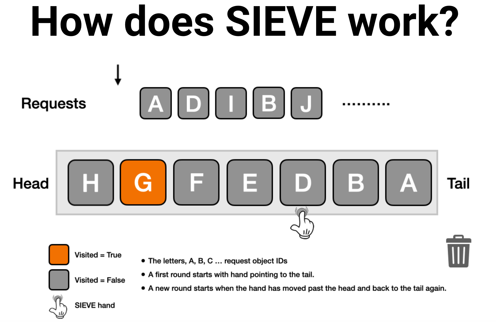

SIEVE Cache in Java
===================

SIEVE is simpler than LRU with following features:

* Simplicity: easy to implement and can be easily integrated into existing systems.
* Efficiency: achieves state-of-the-art efficiency on skewed workloads.
* Cache Primitive: facilitates the design of advanced eviction algorithms.



# Get started
 
* Add dependency to `pom.xml`:

```xml
<dependency>
    <groupId>org.mvnsearch</groupId>
    <artifactId>sieve-cache</artifactId>
    <version>0.1.0</version>
</dependency>
```
* Create a cache instance and use it:

```
   Cache<String> cache = new SieveCache<>();
   cache.put("nick", "Jackie");
   System.out.println(cache.get("nick"));
```

# References
        
* SIEVE: https://cachemon.github.io/SIEVE-website/
* SIEVE is simpler than LRU: https://cachemon.github.io/SIEVE-website/blog/2023/12/17/sieve-is-simpler-than-lru/